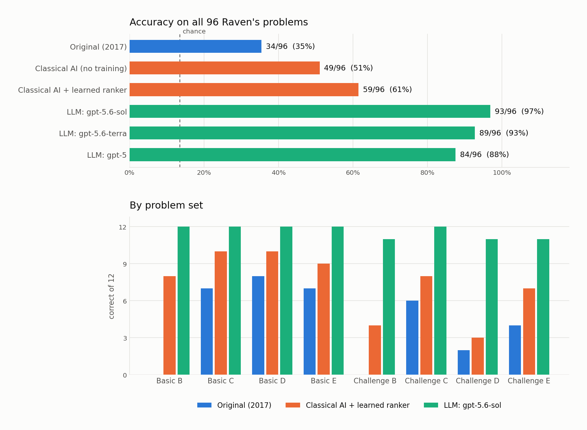

# Raven's Progressive Matrices: three generations of agent

All three agents are scored on the **same 96 problems** (Basic and Challenge sets B, C, D and E, 12 problems each) with the **same input** -- the panel images only. No agent is given the verbal representation that ships with sets Basic B and Basic C, because the other six sets do not have one.

Every number below is generated by `scripts/compare.py` from the CSVs in `results/`. Nothing is hand-entered.

*The 2017 agent has no bar on Basic B or Challenge B because it declines every 2x2 problem rather than guessing.*

## Headline

| Agent | Correct | Accuracy | Skipped | Wall clock | Needs network |
|---|---|---|---|---|---|
| Original (2017) | 34/96 | **35.4%** | 24 | 34 s | no |
| Classical AI (no training) | 49/96 | **51.0%** | 0 | 54 s | no |
| Classical AI + learned ranker | 59/96 | **61.5%** | 0 | 54 s | no |
| LLM: gpt-5.6-sol | 93/96 | **96.9%** | 0 | 77 s | yes |
| LLM: gpt-5.6-terra | 89/96 | **92.7%** | 0 | 193 s | yes |
| LLM: gpt-5 | 84/96 | **87.5%** | 0 | 30 min | yes |

Chance is 13.5% (24 problems with 6 options, 72 with 8). Wall clock for the local agents is single-process on a laptop; the two classical rows come from one `solver.py` run and share its time. For the LLMs it is the whole 96-problem sweep at 10 concurrent requests.

## By problem set

| Agent | Basic B | Basic C | Basic D | Basic E | Challenge B | Challenge C | Challenge D | Challenge E | Total |
|---|---|---|---|---|---|---|---|---|---|
| Original (2017) | 0 | 7 | 8 | 7 | 0 | 6 | 2 | 4 | **34** |
| Classical AI (no training) | 9 | 6 | 7 | 9 | 7 | 4 | 4 | 3 | **49** |
| Classical AI + learned ranker | 8 | 10 | 10 | 9 | 4 | 8 | 3 | 7 | **59** |
| LLM: gpt-5.6-sol | 12 | 12 | 12 | 12 | 11 | 12 | 11 | 11 | **93** |
| LLM: gpt-5.6-terra | 12 | 12 | 12 | 11 | 10 | 12 | 11 | 9 | **89** |
| LLM: gpt-5 | 11 | 12 | 12 | 11 | 8 | 12 | 9 | 9 | **84** |

Twelve problems per set. `Basic B` and `Challenge B` are 2x2 matrices with six options; the rest are 3x3 with eight.

## Where they differ

Comparing the 2017 agent, the classical agent and the strongest LLM (`gpt-5.6-sol`):

- **Nobody solved 3** of the 96: `Challenge Problem B-06`, `Challenge Problem D-08`, `Challenge Problem E-08`
- Solved by the LLM but not the classical agent: **34**
- Solved by the classical agent but not the LLM: **0** -- the LLM's coverage is a strict superset
- Solved by the 2017 agent but not the classical agent: **8**
- Solved by the classical agent but not the 2017 agent: **33**

## What the LLM runs cost

| Model | Accuracy | Input tokens | Output tokens | of which reasoning | Sum of per-call latency | API errors |
|---|---|---|---|---|---|---|
| gpt-5.6-sol | 93/96 (97%) | 243,912 | 29,504 | 24,621 | 698 s | 0 |
| gpt-5.6-terra | 89/96 (93%) | 243,912 | 44,419 | 39,659 | 920 s | 0 |
| gpt-5 | 84/96 (88%) | 383,928 | 484,800 | 474,880 | 9104 s | 0 |

Runs used 10 concurrent workers, so wall-clock in the headline table is much lower than the summed latency here.

## Does the LLM know when it is wrong?

The models were asked for a confidence with every answer.

| Model | Mean confidence when right | Mean confidence when wrong | Distinct values used |
|---|---|---|---|
| gpt-5.6-sol | 0.990 | 0.990 | 4 (0.92, 0.98, 0.99, 1) |
| gpt-5.6-terra | 0.982 | 0.970 | 9 (0.7, 0.82, 0.9, 0.93, 0.94, 0.96 ...) |
| gpt-5 | 0.911 | 0.728 | 27 (0.41, 0.55, 0.62, 0.66, 0.68, 0.71 ...) |

Confidence is not a useful signal here. The models are as sure of their wrong answers as their right ones, so there is no threshold at which you could route the hard problems to a human. The classical agent's rule-trust score has the same weakness in a different form -- it tells you how well a rule fits, not whether the rule is the right one.

## What each agent cost to build

| Agent | Lines of agent code | Dependencies | Tuning signal |
|---|---|---|---|
| Original (2017) | 574 | numpy, Pillow | weights nudged by hand against 2 of the 8 sets |
| Classical AI | 964 | numpy, Pillow, scipy, scikit-learn | rules validated against hidden lines; family weights fitted, reported under nested cross-validation |
| LLM | 339 | openai | none -- one prompt, no examples, no per-set tuning |

Line counts exclude the course-provided harness; the shared 119-line problem loader is counted for both agents that use it. The LLM agent is the smallest of the three and almost all of it is plumbing -- assembling images, declaring a JSON schema, retrying on transient API errors. Everything it knows about Raven's matrices is 134 words of English in one system prompt. The classical agent is the largest, and every line of it encodes a specific belief about what Raven's problems can do.

## What this shows

**Eight-year-old Python just runs.** The 2017 agent needed no porting at all -- not a shim, not a deprecation warning -- to run on Python 3.12 with modern numpy and Pillow. Its two genuine scoring bugs turn out not to matter: fixing them changes the score by at most one problem, because the weights were hand-tuned around the bugs until the number went up. The typos were load-bearing.

**Its ceiling is architectural, not a matter of tuning.** It summarises each panel with a handful of scalars -- ink coverage, shared ink, centroid. No weighting of those numbers can express *the inner shape rotates while the outer frame stays put*, so no amount of tuning gets it past the mid-30s. It also declines all 24 of the 2x2 problems outright, which is a quarter of the test scored at zero.

**For the classical agent, finding rules was easy and choosing between them was hard.** Its rule space contains the correct answer somewhere in **95/96** problems, and if an oracle named the right *family* of rule it would score **90/96**. Simply believing the single most-trusted rule scores **34/96** -- almost exactly what the 2017 agent gets. Nearly all the headroom in a symbolic solver is in rule *selection*, which is why the biggest single improvement here came from scoring rules by their ability to recover a hidden line of the matrix rather than by how well they fit the visible one. Reproduce with `python 02_classical_ai/diagnose.py`.

**Learning helps, and it survives being measured honestly.** Rule search alone answers 49/96; adding a learned ranker takes it to 59/96 under nested leave-one-problem-set-out -- trained on seven sets, tested on the eighth, every hyper-parameter chosen inside the training folds. Fitting the ranker on all 96 problems and scoring it on those same 96 -- the number you get if you forget to hold anything out -- gives 62/96, and standard leave-one-problem-out gives 56/96. A gap that small is the point: with 48 features, 96 problems and a strongly regularised pairwise ranker, the model is learning which rule families to trust rather than memorising which answers are correct. Had the in-sample number come in twenty points high, that would have been the headline instead.

**The LLM wins by a lot, with a third of the code and no tuning at all.** 93/96 against 59/96 and 34/96, from one prompt and no examples. It is not merely better on average -- it solved every problem the classical agent solved, plus 34 more. Two things to keep in view. These puzzles have been in a public GitHub repository since 2017, so contamination cannot be ruled out. And the model's confidence is worthless: it reported ~0.99 on every answer, right or wrong, so there is no threshold that would let you catch its mistakes automatically.

**The three agents fail in different ways, and that is the useful part.** The 2017 agent fails by declining. The classical agent fails by picking a rule that fits the visible cells but is not the rule the problem is about -- you can read exactly which one it picked with `solver.py --explain`. The LLM fails confidently and without a trace you can debug. Only the middle one tells you *why* it was wrong.

## Per-problem answers

`.` = correct, number = the wrong option it chose, `skip` = declined to answer.

| Problem | Truth | Original (2017) | Classical AI (no training) | Classical AI + learned ranker | LLM: gpt-5.6-sol | LLM: gpt-5.6-terra | LLM: gpt-5 |
|---|---|---|---|---|---|---|---|
| Basic Problem B-01 | 2 | skip | . | . | . | . | . |
| Basic Problem B-02 | 5 | skip | . | . | . | . | . |
| Basic Problem B-03 | 1 | skip | . | . | . | . | . |
| Basic Problem B-04 | 3 | skip | . | . | . | . | . |
| Basic Problem B-05 | 4 | skip | . | . | . | . | . |
| Basic Problem B-06 | 5 | skip | . | 6 | . | . | . |
| Basic Problem B-07 | 6 | skip | . | . | . | . | 5 |
| Basic Problem B-08 | 6 | skip | . | . | . | . | . |
| Basic Problem B-09 | 5 | skip | . | 4 | . | . | . |
| Basic Problem B-10 | 3 | skip | 5 | 5 | . | . | . |
| Basic Problem B-11 | 1 | skip | 2 | . | . | . | . |
| Basic Problem B-12 | 1 | skip | 5 | 5 | . | . | . |
| Basic Problem C-01 | 3 | . | . | . | . | . | . |
| Basic Problem C-02 | 4 | 8 | . | . | . | . | . |
| Basic Problem C-03 | 4 | . | 5 | . | . | . | . |
| Basic Problem C-04 | 8 | . | . | . | . | . | . |
| Basic Problem C-05 | 3 | 6 | 1 | . | . | . | . |
| Basic Problem C-06 | 7 | . | . | . | . | . | . |
| Basic Problem C-07 | 2 | . | . | . | . | . | . |
| Basic Problem C-08 | 5 | . | 1 | . | . | . | . |
| Basic Problem C-09 | 2 | 4 | 6 | 4 | . | . | . |
| Basic Problem C-10 | 7 | 2 | 3 | . | . | . | . |
| Basic Problem C-11 | 4 | . | . | . | . | . | . |
| Basic Problem C-12 | 8 | 1 | 7 | 5 | . | . | . |
| Basic Problem D-01 | 3 | . | . | . | . | . | . |
| Basic Problem D-02 | 1 | . | . | . | . | . | . |
| Basic Problem D-03 | 3 | . | . | 4 | . | . | . |
| Basic Problem D-04 | 1 | 2 | . | . | . | . | . |
| Basic Problem D-05 | 7 | 3 | . | . | . | . | . |
| Basic Problem D-06 | 1 | . | 6 | . | . | . | . |
| Basic Problem D-07 | 1 | . | 4 | . | . | . | . |
| Basic Problem D-08 | 4 | . | 1 | . | . | . | . |
| Basic Problem D-09 | 3 | . | 7 | . | . | . | . |
| Basic Problem D-10 | 1 | 2 | 2 | . | . | . | . |
| Basic Problem D-11 | 3 | . | . | . | . | . | . |
| Basic Problem D-12 | 3 | 1 | . | 1 | . | . | . |
| Basic Problem E-01 | 1 | . | 5 | . | . | . | . |
| Basic Problem E-02 | 7 | . | . | 3 | . | . | . |
| Basic Problem E-03 | 2 | . | . | 3 | . | 1 | . |
| Basic Problem E-04 | 8 | 3 | . | . | . | . | . |
| Basic Problem E-05 | 5 | 6 | . | . | . | . | . |
| Basic Problem E-06 | 8 | . | 6 | . | . | . | . |
| Basic Problem E-07 | 3 | . | . | 4 | . | . | . |
| Basic Problem E-08 | 1 | . | . | . | . | . | . |
| Basic Problem E-09 | 7 | 5 | . | . | . | . | . |
| Basic Problem E-10 | 8 | 6 | . | . | . | . | . |
| Basic Problem E-11 | 5 | 8 | . | . | . | . | . |
| Basic Problem E-12 | 6 | . | 1 | . | . | . | 4 |
| Challenge Problem B-01 | 6 | skip | . | . | . | . | . |
| Challenge Problem B-02 | 1 | skip | . | 3 | . | 3 | 4 |
| Challenge Problem B-03 | 3 | skip | 2 | 2 | . | 1 | . |
| Challenge Problem B-04 | 4 | skip | 2 | 2 | . | . | 1 |
| Challenge Problem B-05 | 6 | skip | 3 | 1 | . | . | . |
| Challenge Problem B-06 | 3 | skip | 6 | 6 | 4 | . | . |
| Challenge Problem B-07 | 6 | skip | . | 2 | . | . | 5 |
| Challenge Problem B-08 | 4 | skip | 2 | 6 | . | . | . |
| Challenge Problem B-09 | 4 | skip | . | 1 | . | . | . |
| Challenge Problem B-10 | 4 | skip | . | . | . | . | 1 |
| Challenge Problem B-11 | 5 | skip | . | . | . | . | . |
| Challenge Problem B-12 | 1 | skip | . | . | . | . | . |
| Challenge Problem C-01 | 7 | 3 | . | . | . | . | . |
| Challenge Problem C-02 | 7 | 6 | 2 | . | . | . | . |
| Challenge Problem C-03 | 3 | . | . | . | . | . | . |
| Challenge Problem C-04 | 8 | . | 3 | . | . | . | . |
| Challenge Problem C-05 | 4 | . | 8 | 3 | . | . | . |
| Challenge Problem C-06 | 7 | 6 | . | . | . | . | . |
| Challenge Problem C-07 | 3 | . | . | . | . | . | . |
| Challenge Problem C-08 | 1 | 5 | 2 | 2 | . | . | . |
| Challenge Problem C-09 | 7 | . | 2 | 8 | . | . | . |
| Challenge Problem C-10 | 3 | 6 | 1 | 1 | . | . | . |
| Challenge Problem C-11 | 4 | 7 | 7 | . | . | . | . |
| Challenge Problem C-12 | 2 | . | 1 | . | . | . | . |
| Challenge Problem D-01 | 2 | 7 | 3 | 1 | . | . | . |
| Challenge Problem D-02 | 1 | 3 | . | . | . | . | . |
| Challenge Problem D-03 | 1 | . | . | 6 | . | . | . |
| Challenge Problem D-04 | 6 | . | 2 | . | . | . | . |
| Challenge Problem D-05 | 2 | 6 | 6 | 6 | . | . | 8 |
| Challenge Problem D-06 | 6 | 3 | . | . | . | . | . |
| Challenge Problem D-07 | 4 | 5 | 5 | 6 | . | . | . |
| Challenge Problem D-08 | 1 | 6 | . | 5 | 2 | 6 | 2 |
| Challenge Problem D-09 | 7 | 5 | 3 | 4 | . | . | . |
| Challenge Problem D-10 | 5 | 3 | 6 | 6 | . | . | . |
| Challenge Problem D-11 | 5 | 0 | 8 | 7 | . | . | 2 |
| Challenge Problem D-12 | 6 | 5 | 4 | 8 | . | . | . |
| Challenge Problem E-01 | 6 | . | 1 | . | . | . | . |
| Challenge Problem E-02 | 7 | 5 | . | 8 | . | . | . |
| Challenge Problem E-03 | 5 | 4 | . | . | . | 8 | . |
| Challenge Problem E-04 | 5 | . | 7 | . | . | . | . |
| Challenge Problem E-05 | 6 | 2 | 2 | . | . | . | . |
| Challenge Problem E-06 | 7 | 1 | 6 | 5 | . | . | . |
| Challenge Problem E-07 | 5 | 2 | 2 | . | . | . | . |
| Challenge Problem E-08 | 7 | 5 | 5 | 6 | 3 | 3 | 5 |
| Challenge Problem E-09 | 1 | 5 | 5 | 5 | . | 6 | 2 |
| Challenge Problem E-10 | 1 | 8 | 5 | . | . | . | 2 |
| Challenge Problem E-11 | 3 | . | . | . | . | . | . |
| Challenge Problem E-12 | 5 | . | 2 | 7 | . | . | . |
