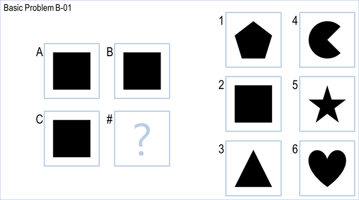
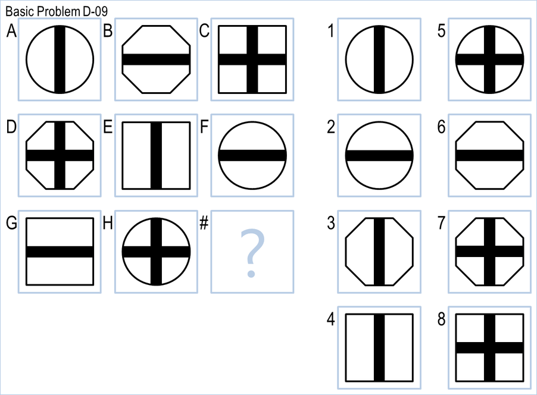
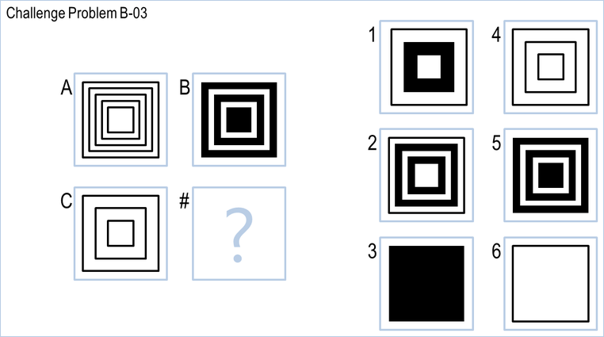
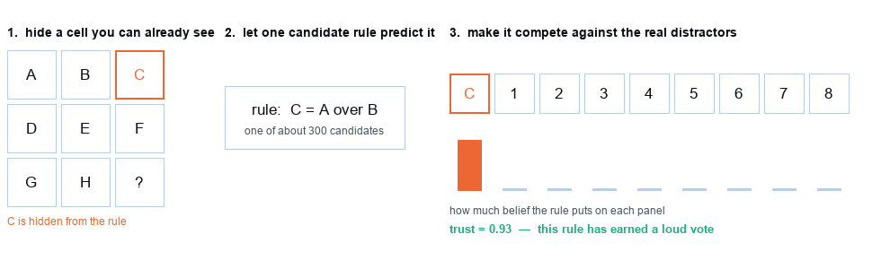
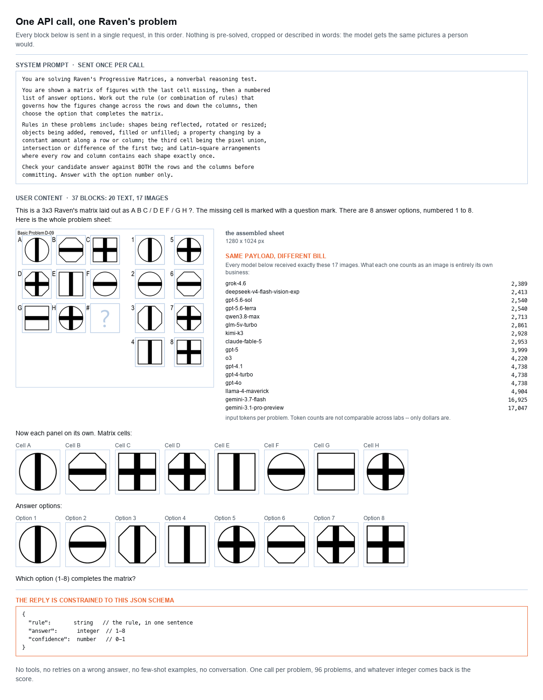
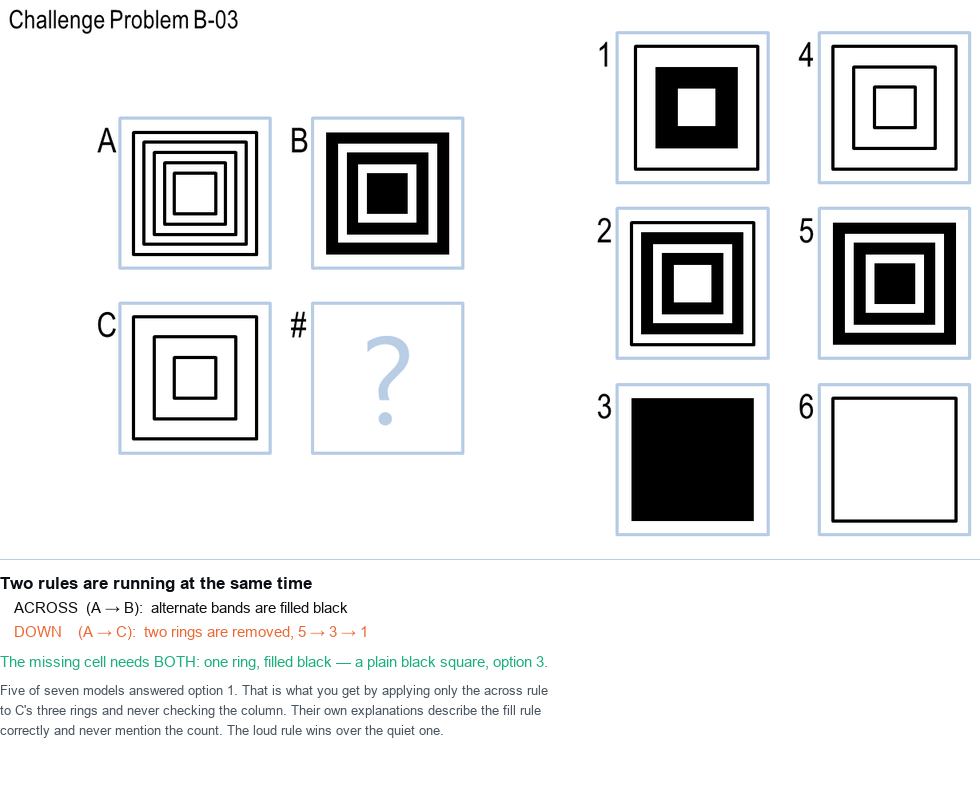
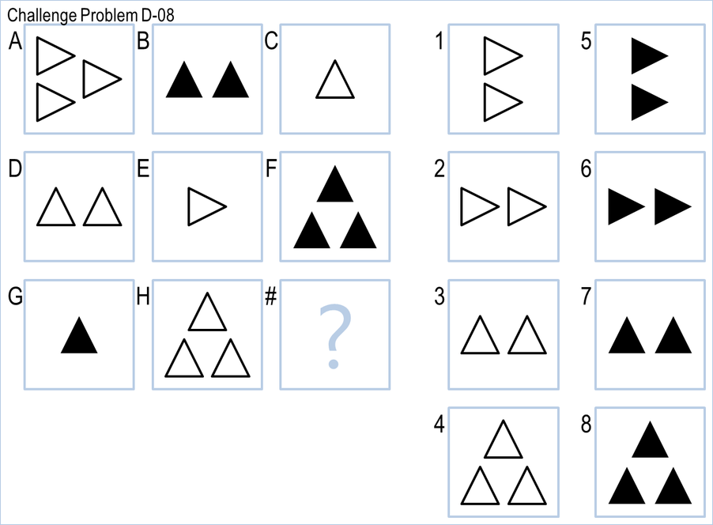

# Can a computer pass an IQ test?

Three programs, written across eight years, all trying to solve the same 96 puzzles. One was written by a student in 2017. One was written this year with no artificial intelligence of the kind you have been reading about. One is that kind of AI. This is what happened when they sat the same test.

Everything here is reproducible: every number in this document is generated from the raw results by a script, not typed in by hand. The complete set of instructions that produced it is in [PROMPT_HISTORY.md](PROMPT_HISTORY.md), quoted exactly as typed.

| | Score out of 96 | |
|---|---|---|
| The 2017 student project | **34** | 35% |
| A modern program with no AI language model | **59** | 62% |
| An AI language model (`gpt-5.6-sol`) | **93** | 97% |
| Guessing at random | 13 | 13% |

The rest of this explains what each one was doing, why the gaps are the size they are, and — more usefully — where the AI still fails and why.

---

## 1. The test

**Raven's Progressive Matrices** is a reasoning test designed in 1936. It uses no words and no numbers, which is the point: it was built to measure reasoning without measuring education or language. You are shown a grid of pictures with the last one missing, and a set of options. Work out the pattern; pick the piece that completes it.

It is still widely used, including in some hiring and university admissions processes. So "can software do this?" is not an idle question.

### An easy one



Three cells, all the same black square. Whatever rule is operating, it is not changing anything, so the fourth cell is a black square too: **option 2**. Almost anything can do this one.

### A harder one



Now there are two things going on at once. Every cell has an **outer shape** (circle, octagon, square) and an **inner pattern** (vertical bar, horizontal bar, cross). Look along any row or column: each outer shape appears exactly once, and each bar pattern appears exactly once — like a sudoku made of pictures. The bottom row already has a square-with-horizontal-bar and a circle-with-cross, so the missing cell must be the octagon with the vertical bar: **option 3**.

This is the real skill the test is measuring — noticing that two independent patterns are running at the same time and tracking both.

### A genuinely hard one



Keep this one in mind. It is the single problem that defeated the most AI models, and section 6 comes back to it.

---

## 2. Contestant one: the 2017 student project

The starting point was a real university assignment from eight years ago, written for a Georgia Tech course on knowledge-based AI. **It was run completely unmodified** — not a single character changed — and it still works on today's software. It answered all 96 problems in 34 seconds.

### What it does

Its strategy is to turn each picture into a handful of numbers, then do arithmetic on them. The main number is simply **what percentage of the square is covered in black ink**. If ink coverage goes 10%, 20%, 30% along a row, the next one should be about 40%, so pick the option closest to that.

It has six other measurements in the same spirit: how much ink two pictures share, where the ink sits on average, whether a picture is an exact repeat of another. Each measurement scores every option, the scores are combined using weights the author tuned by hand, and the highest total wins.

### What it got right

Three of its ideas are genuinely good, and all three reappear in the modern programs below. It compares **relationships rather than objects** — it does not ask "which option looks like the cell above?" but "is the gap between the answer and the cell above the same as the gap between the two cells before it?" That is what analogy actually is. It **eliminates** options that are exact copies of a visible cell. And it **tests a rule on the rows it can see** before applying it to the row it cannot.

### Why it stops at 35%

Two reasons, and neither is a bug. First, **it refuses to attempt 24 of the 96 problems** — every 2x2 puzzle, a quarter of the test, scored zero because that part was never finished before the deadline.

Second, and more interesting: **a picture reduced to a few numbers loses the information the harder problems depend on.** Ink coverage cannot tell you that the inner shape rotated while the outer frame stayed still. Two completely different pictures can have identical ink coverage. No amount of adjusting the weights recovers something the measurements never captured.

There is a nice footnote here. The code contains two genuine arithmetic mistakes in the scoring formula. Fixing them changes the score by at most one problem, and fixing both makes it slightly *worse* — because the weights had been tuned by trial and error around the mistakes. The bugs had been absorbed into the tuning. (`01_original_2017/typo_experiment.py` runs this.)

---

## 3. Contestant two: a modern program, no AI language model allowed

The rule for this one was: solve the puzzles using any technique you like, except the sort of AI that has read the internet. So this program has to be *told* how to reason, in code.

### The approach, and why

The 2017 program's limit was that it measured seven things and hoped one of them mattered. The obvious fix is to **propose a large number of possible rules and then work out which one is actually in force**. So this program generates roughly 300 candidate rules for every puzzle:

- *Is something being flipped or rotated?* (eight geometric transformations)
- *Is the third picture the overlap, or the combination, or the difference of the first two?* (six ways of combining two images pixel by pixel)
- *Is some measurable quantity counting up?* (eight measurements — ink, number of separate objects, number of enclosed holes, symmetry, and so on)
- *Is this a sudoku-style arrangement where every row contains each shape once?* (checked against five different ways of splitting a picture into its parts — outer frame, inner shape, interior detail)

### The discovery that mattered

Halfway through, a diagnostic was run to answer a simple question: *is the right answer even among the rules we are proposing?* The result reframed the whole project.

| | Score |
|---|---|
| Some proposed rule, somewhere, picks the correct answer | **95/96** |
| If a magic oracle told us which *kind* of rule was in force | **90/96** |
| Simply believing whichever single rule scores highest | **34/96** |

The correct answer is almost always in there. The problem is *choosing*. And notice the bottom row: believing your single best-scoring rule gets 34/96 — which is what the 2017 program scored. Applying one fixed scoring scheme to every puzzle lands in the mid-thirties no matter how good the individual measurements are.

### How rules earn trust

The fix is the most transferable idea in this repository. To decide whether a rule is any good, **hide part of the puzzle you already know the answer to, and see whether the rule can recover it** — competing against the real distractors. A rule that reliably recovers hidden cells gets a loud vote; a rule that cannot gets ignored.



This is the same logic as testing a business forecast by hiding last quarter's figures and checking whether the model predicts them, rather than asking whether it fits the data it was built on.

### Results

Rule search alone, with no learning at all: **49/96**. Adding a small statistical model that learns how much to trust each *type* of rule: **59/96** — nearly double the 2017 program, in 54 seconds on a laptop, with no internet connection.

### A detour: what about a neural network?

A neural network is a program that is not told any rules at all. You show it thousands of solved examples and it works out for itself what predicts the right answer. It is the technology behind image recognition, and it is the obvious thing to try here.

There is an immediate problem: **96 puzzles is nowhere near enough to learn from.** So the standard trick was used — write a program that *invents* Raven's-style puzzles by the thousand, train the network on those, and keep the 96 real ones as a clean test it has never seen.

The result: **10/96**. Worse than guessing.

Four versions were tried. Every one of them learned the *invented* puzzles well — the final version scores about 56% on invented puzzles it had not seen — and every one of them failed on the real ones. Working out why turned out to be the most instructive part of the whole project, and it is in [EPILOGUE.md](EPILOGUE.md). The short version:

> The invented puzzles had a statistical quirk. Because of how they were generated, the correct answer was a repeat of a picture already visible on the page about 30% of the time. In real Raven's problems that is true only 10% of the time — the people who write them deliberately avoid it. The network learned the quirk perfectly, applied it to the real test, and was wrong more often than chance.

**It had not failed to learn. It had learned exactly the wrong thing, because the world it was shown was not the world it was tested in.** That is the single most common way real machine learning projects fail, and it usually looks like this: every training metric healthy, the deployed model quietly useless.

---

## 4. Contestant three: the AI language model

This is the technology behind ChatGPT and its competitors. It has been trained on an enormous amount of text and images. Nobody programmed it to solve Raven's matrices; the question is whether it can anyway.

### Exactly what it is sent

This matters, because "we asked the AI" hides all the engineering. Each puzzle is one request containing **37 pieces of content — 20 short pieces of text and 17 images**:



Reading down that picture: a sentence explaining the grid layout; then the **whole puzzle sheet as one image**; then **each of the eight grid cells as its own labelled image**; then **each of the eight answer options as its own labelled image**; then the question.

Both views are sent deliberately. The full sheet shows the *structure* — which cells form a row, which one is missing — but any single cell inside it is too small to compare shapes reliably. The individual pictures give the detail but lose all sense of position. Neither on its own is enough.

The model is also given a short instruction listing the kinds of rule these puzzles use — 134 words, quoted in full in [03_llm/README.md](03_llm/README.md). That is the only help it gets. **No worked examples, no second attempts, no conversation, and no hints about which set a puzzle came from.** One request, one answer, and whatever comes back is the score.

### Exactly what comes back

The reply is forced into a fixed format, so the answer is always a number that can be marked automatically. Here is a real reply, to the sudoku-style puzzle from section 1:

```json
{
  "rule": "Both the outer shapes and bar patterns cycle through three states in each row and column, requiring an octagon with a vertical bar.",
  "answer": 3,
  "confidence": 0.99
}
```

Correct, in 4.8 seconds. Note that it did not just produce a number — it described the rule, and the description is right. Every one of these explanations is saved in `results/`, including for the puzzles it got wrong, which is what makes section 6 possible.

---

## 5. The results

16 different language models from 9 companies were run on the identical 96 puzzles with the identical prompt. Alongside them, the two programs that run on a laptop with no internet.

| | Score | Accuracy | Cost | Time | Needs internet |
|---|---|---|---|---|---|
| **2017 student project** | 34/96 | 35% | $0 | 34 s | no |
| **Modern program, no language model** | 59/96 | 61% | $0 | 54 s | no |
| `gpt-5.6-sol` *(used in class)* | 93/96 | 97% | $0.78 | 77 s | yes |
| `google/gemini-3.7-flash` | 92/96 | 96% | $1.50 | 144 s | yes |
| `moonshotai/kimi-k3` | 92/96 | 96% | $6.95 | 2157 s | yes |
| `qwen/qwen3.8-max` | 92/96 | 96% | $1.44 | 550 s | yes |
| `x-ai/grok-4.6` | 92/96 | 96% | $3.87 | 1794 s | yes |
| `google/gemini-3.1-pro-preview` | 90/96 | 94% | $6.64 | 344 s | yes |
| `anthropic/claude-fable-5` | 89/96 | 93% | $4.80 | 146 s | yes |
| `gpt-5.6-terra` *(used in class)* | 89/96 | 93% | $1.02 | 193 s | yes |
| `gpt-5` *(used in class)* | 84/96 | 88% | $5.33 | 1773 s | yes |
| `z-ai/glm-5v-turbo` | 77/96 | 80% | $1.36 | 590 s | yes |
| `o3` | 76/96 | 79% | $3.59 | 947 s | yes |
| `deepseek/deepseek-v4-flash-vision-exp` | 51/96 | 53% | $0.53 | 582 s | yes |
| `gpt-4o` | 41/96 | 43% | $1.17 | 36 s | yes |
| `meta-llama/llama-4-maverick` | 41/96 | 43% | $0.10 | 96 s | yes |
| `gpt-4.1` | 36/96 | 38% | $0.95 | 33 s | yes |
| `gpt-4-turbo` | 34/96 | 35% | $4.68 | 101 s | yes |

Costs are for all 96 puzzles. Times are for the whole sweep with ten requests running at once.

### What stands out

**The price spread is far wider than the accuracy spread.** 4 different models from 4 companies tied on exactly 92/96 — and the cheapest of them cost $1.44 while the dearest cost $6.95, 4.8 times more for an identical score. Across the whole table the best model is also close to the cheapest. Picking the biggest, most expensive option is usually the wrong default.

**Progress over two years is dramatic.** The same family of models went from the mid-thirties to the mid-nineties. For context, the mid-thirties is what the 2017 student program scores.

**Being a language model is not enough on its own.** 5 of the 16 scored *below* the hand-written program with no AI in it at all — `deepseek/deepseek-v4-flash-vision-exp` at 51/96, `gpt-4o` at 41/96, `meta-llama/llama-4-maverick` at 41/96, `gpt-4.1` at 36/96, against 59/96. "We used AI" tells you almost nothing; which model, and how it was asked, is most of the outcome.

**One model could not sit the test at all.** `gpt-3.5-turbo`, the model that made ChatGPT famous in 2022, cannot accept images. Not a low score — no score. The barrier is what it can perceive, not how well it reasons.

### Could it be cheaper?

Yes. Every provider sells a **batch** option: submit the work, get it back within 24 hours, pay about half. For this workload — 96 independent questions with nobody waiting — that is close to free money. Running all of these in batch mode would have cost roughly half. Details and per-model figures in [EPILOGUE.md](EPILOGUE.md).

The trade-off is only speed. The classroom demonstration finished in 77 seconds and the results went on the screen immediately; in batch mode it would have been cheaper and useless for that purpose. **A benchmark is the ideal batch job. A demo is not.**

### Is this a fair test of the language models?

Only partly, and it is worth being honest about. These puzzles have been in a public code repository since 2017, so they may well have been part of what the models were trained on. A score of 97% here is a score on a *public, possibly-memorised* test. The two laptop programs have no such advantage, which is one reason they are worth keeping in the comparison.

---

## 6. The class sweepstake

Before any code was written, 37 students were asked to predict two things. Here is how they did.

### "Will it solve even one puzzle without an LLM by the end of class?"

**Yes — after 9 minutes and 34 seconds.** The first version of the no-LLM program ran at 13:08 and scored 55/96 straight away, before any learning was added at all.

**35 of 37 students (95%) called it correctly.** The class was right to be optimistic — though as section 3 shows, getting *something* working in ten minutes and getting it working *well* were very different problems.

### "How many of the 96 will the non-LLM version solve?"

**The answer was 59.**

| | Student | Guess | Off by |
|---|---|---|---|
| 🥇 **GOLD** *(tie)* | **Annie Huang** | 60 | 1 |
| 🥇 **GOLD** *(tie)* | **Sonny Arden** | 60 | 1 |
| 🥈 **SILVER** | **Max Polin** | 62 | 3 |
| 🥉 **BRONZE** | **Harshal Puranik** | 54 | 5 |
| **4th** *(tie)* | **Elizabeth Hsu** | 50 | 9 |
| **4th** *(tie)* | **Danny Weng** | 50 | 9 |

Two exact ties at the top: **Annie Huang** and **Sonny Arden** both said 60 and were one away.

As a group the class was well calibrated. The median guess was 50 against a true answer of 59, with 17 guesses too high and 20 too low — almost exactly balanced. Only 7 students landed within 10, and the full range ran from 0 to 96, so the *average* of the class beat almost every individual in it. That is a real and repeatable effect, and it is why prediction markets work.

---

## 7. Where the AI still fails

This is the most useful section, because the failures are not random.

Taking the 11 models that scored 70% or better:

- **60 of the 96 puzzles** were solved by every single one of them.
- The **23 puzzles that two or more models missed** account for **86% of all the mistakes made**.
- When several models miss the same puzzle, **about 68% of them choose the same wrong option** — against roughly 14% if they were guessing.

Different companies, different technology, different training data, arriving at the same wrong answer. **The failures are a property of the puzzles, not of any one product.** If you are evaluating an AI tool for your own use, this is the pattern to look for: not "how often is it wrong" but "is it wrong in a predictable place".

### Failure one: two rules at once, and it only applies the obvious one



Five of seven models got this wrong, and four of them gave the *same* wrong answer. What makes it hard is that two rules run simultaneously: going across, alternate bands get filled black; going down, two rings are removed each time (5, then 3, then 1). The answer needs both, which leaves a single filled ring — a plain black square.

The models saw the filling rule and stopped. You can watch it happen in their own explanations, which describe the fill perfectly and never mention the count:

> *"The right column shows the left column's concentric squares with alternate rings filled black."* — a flawless description of half the puzzle.

The two models that solved it stated both rules. **And they had all been explicitly instructed to check rows and columns before answering.** Being told was not enough: the visually dramatic rule crowded out the quiet numerical one. That is a recognisably human error.

### Failure two: right rule, lost count



Here three patterns run at once — how many triangles (1, 2 or 3), whether they are filled or outlined, and which way they point. Four of seven models missed it, and this time they **described the rule correctly and still picked the wrong cell**:

> *"Each row and column contains one cell with 1, 2, and 3 triangles, while the styles cycle among filled upright, outlined upright, and outlined right-pointing"* — then names the wrong option.

That is not a reasoning failure, it is a **bookkeeping** failure. Three constraints have to be held in mind and intersected at once, and they lose track — the same way you might when filling in a sudoku in your head rather than on paper.

Which is exactly what the no-AI program does perfectly and for free, because for it that step is six lines of code checking every combination.

### The pattern

**Language models are much better at *noticing* what kind of rule is present. They are worse at the exhaustive checking afterwards.** The hand-written program is the mirror image: hopeless at spotting which of 300 candidate rules matters, flawless at verifying one once chosen.

The practical lesson generalises well beyond puzzles: use a language model for the judgement call, and ordinary software for the arithmetic that follows. Asking the model to do both in one step is where these mistakes come from.

### And it does not know when it is wrong

Every model was asked to rate its own confidence. The best one reported **0.99 on every single answer — including all three it got wrong.** There is no threshold you could set to catch its mistakes automatically. If you are deploying one of these, do not expect it to flag its own errors.

---

## 8. What to take from this

**Old software is more durable than you think.** Eight-year-old code ran untouched. The expensive part of software is rarely keeping it alive; it is that its original design decides its ceiling.

**Most of the gain came from measuring the right thing.** The single most useful hour was spent not writing a solver but running a diagnostic that asked *where is the bottleneck?* The answer — choosing between rules, not finding them — redirected everything after it. Before optimising, find out what you are optimising.

**A model is only as good as the world you show it.** The neural network learned its training data faithfully and scored below random guessing, because that data had a quirk the real test did not. No training metric revealed it. Only looking at the data next to the real thing did.

**Test on what you did not train on, and do it more than once.** An early reading of one experiment said 65.5%; running the same thing 20 times with different random splits said 61.6%, ranging from 52% to 76% depending on the split. A single measurement on a small sample is close to worthless.

**Confident and correct are unrelated.** Both the language models and the neural network were most confident precisely where they were most wrong.

**And measure your own tooling before blaming the model.** Three models initially scored 0 out of 96. All three were bugs in how the questions were being sent, not failures of the models. A suspiciously round zero is almost always yours.

---

## 9. Technical notes

*For readers who want to run or extend this. Everything below is optional.*

### Getting started

```bash
pip install -r requirements.txt

python run_original.py                    # the 2017 agent          (~35 s)
python 02_classical_ai/solver.py          # the no-LLM agent        (~60 s)
python 02_classical_ai/diagnose.py        # the bottleneck analysis
python 04_neural/solver.py --steps 8000   # train the neural net    (~15 min)

export OPENAI_API_KEY=...
python 03_llm/solver.py --model gpt-5.6-sol

python scripts/compare.py                 # rebuild COMPARISON.md
```

Agents one and two need no network. All numbers in this document, [COMPARISON.md](COMPARISON.md) and [EPILOGUE.md](EPILOGUE.md) are regenerated from `results/` by the scripts in `scripts/`.

### Software architecture

```
                        Problems/            96 puzzles, unchanged from 2017
                            |
                   common/ravens.py          one loader, so all agents see
                            |                identical inputs
        +-------------------+-------------------+------------------+
        |                   |                   |                  |
  01_original_2017/   02_classical_ai/     03_llm/            04_neural/
  Agent.py            imageops.py          solver.py          render.py
  (vendored, byte-    features.py          openrouter_        wren.py
   identical)         solver.py             solver.py         solver.py
        |                   |                   |                  |
        +-------------------+---------+---------+------------------+
                                      |
                                  results/      one CSV per run
                                      |
        +----------------+------------+------------+----------------+
     compare.py     make_epilogue.py  make_page.py  error_analysis.py
        |                |                 |              |
  COMPARISON.md    EPILOGUE.md      docs/index.html   analysis txt
```

### Data flow, agent by agent

| Agent | Input | Intermediate representation | Output |
|---|---|---|---|
| 2017 | 16 PNGs | 7 scalars per panel | weighted sum, argmax |
| Classical | 16 PNGs | 5 attribute decompositions -> ~300 scored rules -> 48 features per option | learned ranking, argmax |
| LLM | 17 PNGs + prompt | *(none you can inspect)* | JSON `{rule, answer, confidence}` |
| Neural | 16 PNGs at 64x64 | 128-d embedding per panel -> pairwise relation vectors | softmax over options |

### Where the interesting code is

| Question | File |
|---|---|
| How is a rule proposed and scored? | `02_classical_ai/features.py` — `score_rules()` and `_validation_score()` |
| How is a picture decomposed into parts? | `02_classical_ai/imageops.py` — `DESCRIPTORS` |
| What exactly is sent to the model? | `03_llm/solver.py` — `build_input()` |
| How are synthetic puzzles invented? | `04_neural/render.py` — `make_problem()` |
| The relation network | `04_neural/wren.py` |
| Why did the network fail? | `04_neural/diagnose.py` |
| Is the evaluation honest? | `02_classical_ai/split_eval.py` |

### Things worth trying

- Run `python 02_classical_ai/solver.py --explain "Basic Problem E-05"` to see which rules the program trusted and what each one voted for.
- Add a rule family to `features.py` and see whether the cross-validated score moves. Most ideas do not help; that is the lesson.
- Change the synthetic puzzle generator in `04_neural/render.py` and re-run `04_neural/diagnose.py`. Try to close the gap between the invented world and the real one.
- Send the language model *only* the individual panels, or *only* the assembled sheet, and see how much each view is worth.

### Full documentation

| | |
|---|---|
| [COMPARISON.md](COMPARISON.md) | the in-class results, per set and per problem |
| [EPILOGUE.md](EPILOGUE.md) | the neural network, the train/test split, all eleven models |
| [docs/BUILD_LOG.md](docs/BUILD_LOG.md) | every experiment tried, including the six that were dropped |
| [01_original_2017/NOTES.md](01_original_2017/NOTES.md) | the 2017 code in detail |
| [03_llm/README.md](03_llm/README.md) | the full prompt and payload |
| [PROVENANCE.md](PROVENANCE.md) | who asked for what, which models did the work |
| [PROMPT_HISTORY.md](PROMPT_HISTORY.md) | every instruction given, verbatim, in order |

---

Problems and harness from the Georgia Tech Knowledge-Based AI project, via [bcollier/KBAI_Ravens_Project](https://github.com/bcollier/KBAI_Ravens_Project). Agents two, three and four, the evaluation harness and this write-up were built with [Claude Code](https://claude.com/claude-code).
